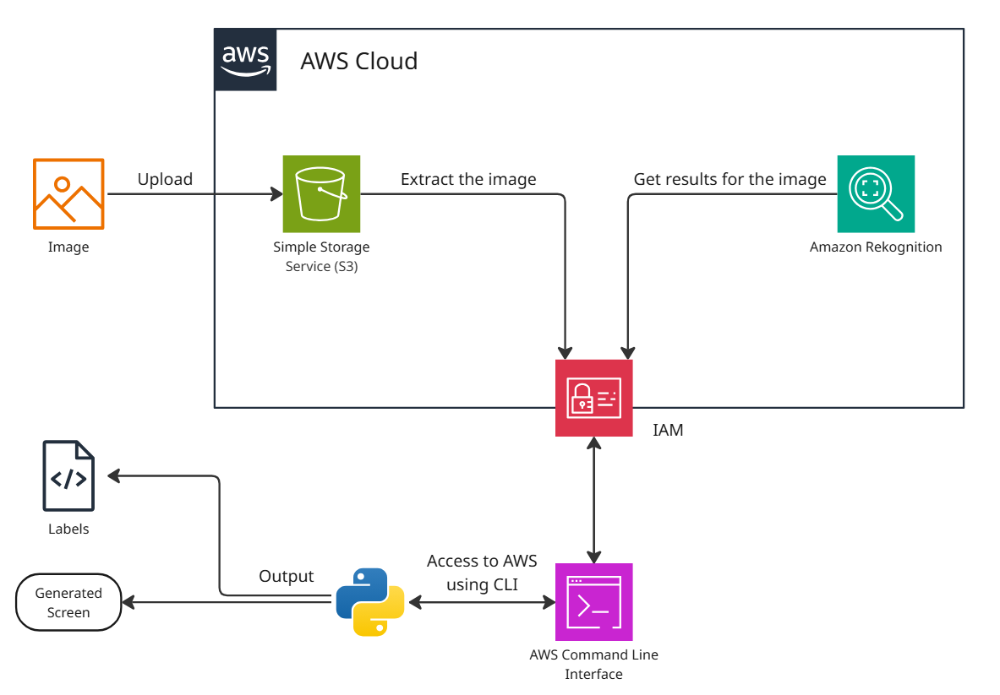
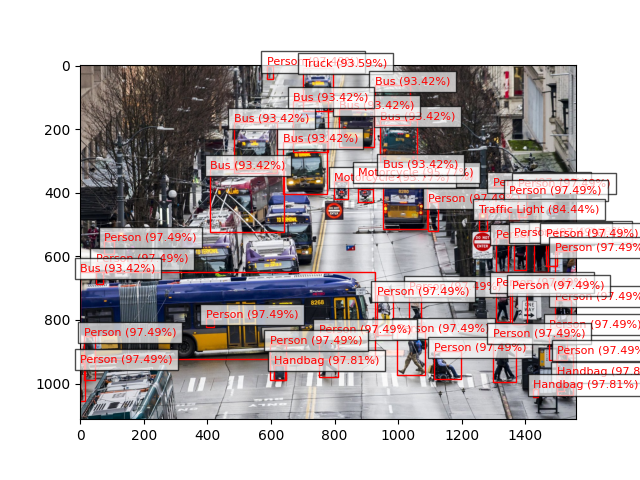
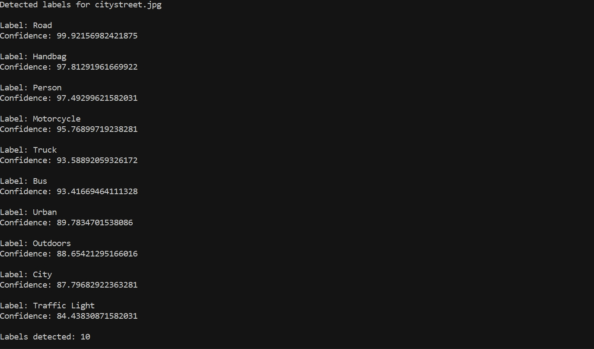

# AWS Rekognition Image Label Generator Application
A Python-based application that leverages **Amazon Rekognition** to detect and label objects in images stored in Amazon S3. This project integrates AWS CLI commands, AI-powered image analysis, and cloud storage into an end-to-end image analysis workflow. Users upload images to an S3 bucket, run label detection, and view both structured terminal output and visual bounding boxes on the images. Infrastructure is provisioned using **AWS CloudFormation** and **Terraform**, demonstrating scalable and reproducible AWS deployments.

## Architecture Overview

*Figure 1: Architecture diagram of the AWS Rekognition Image Label Generator Application.*

**Core Components**  
- **Amazon Rekognition** – AI-powered image label detection service.  
- **Amazon S3** – Scalable object storage for images.  
- **IAM** – Authentication and access management.  
- **AWS CLI** – Command-line interface for AWS service interaction.  
- **Python** – Application logic for processing and visualization.

## Skills Applied
- Using Rekognition’s `detect_labels` API for image analysis.
- Managing permissions with IAM roles and policies.
- Visualizing detected labels with bounding boxes in Python.
- Deploying infrastructure as code with Terraform and CloudFormation.

## Features
- Detects and labels objects in images using **Amazon Rekognition**.  
- Stores and manages images in **Amazon S3**.  
- Command-line execution powered by **AWS CLI**.  
- Visual output with bounding boxes on detected objects.  
- Infrastructure provisioning via **Terraform** and **AWS CloudFormation**.

## Tech Stack
- **Languages:** Python
- **AWS Services:** Rekognition, S3, IAM
- **IaC Tools:** CloudFormation, Terraform
- **Other Tools:** AWS CLI

## Deployment Instructions
> **Note:** All command-line examples use `bash` syntax highlighting to maximize compatibility and readability.  
> If you are using PowerShell or Command Prompt on Windows, the commands remain the same but prompt styles may differ.

To provision the required AWS infrastructure, deploy using **CloudFormation** or **Terraform** templates as included in this repository.

### Option 1: **CloudFormation**
1. Edit parameters in `params.json` to customize the deployment.

2. Navigate to the `cloudformation` folder and deploy:
   ```bash
   cd cloudformation
   aws cloudformation create-stack \
   --stack-name rekognition-stack \
   --template-body file://template.yaml \
   --parameters file://params.json \
   --capabilities CAPABILITY_NAMED_IAM
   ```

### Option 2: **Terraform**
1. Edit variables in `terraform.tfvars` and/or `variables.tf` to customize the deployment.

2. Navigate to the `terraform` folder and deploy:
   ```bash
   cd terraform
   terraform init
   terraform plan # Optional, but recommended.
   terraform apply
   ```

**Note**: Ensure the AWS CLI is configured (`aws configure`) with credentials that have sufficient permissions to create **S3 buckets**, **Rekognition** resources, and **IAM roles**.

## Project Structure
```plaintext
aws-rekognition-image-label-generator/
├── assets/                      # Images, diagrams, screenshots
│   ├── architecture-diagram.png      # Project architecture overview
│   ├── sample-image.png              # Original image
│   ├── sample-image-labeled.png      # Labeled output from Rekognition
│   └── sample-terminal-results.png   # Sample CLI output
├── cloudformation/              # AWS CloudFormation templates
│   ├── template.yaml                 # Main CloudFormation template
│   └── params.json                   # Parameter values for CloudFormation
├── terraform/                   # Terraform templates
│   ├── main.tf                       # Main Terraform config
│   ├── variables.tf                  # Input variables
│   ├── outputs.tf					  # Exported values
│   ├── terraform.tfvars              # Default variable values
│   ├── providers.tf			      # AWS provider definition
│   └── versions.tf					  # Terraform version constraint
├── src/                         # Source code
│   └── image_labeler.py              # Python script
├── LICENSE                      
├── README.md                   
└── .gitignore                 
```

## Screenshots


*Figure 2: Sample output image with detected labels and bounding boxes.*


*Figure 3: Terminal output showing detected labels and confidence scores.*

## How to Use
1. **Deploy the infrastructure** using either the CloudFormation or Terraform instructions above.

2. **Upload an image to S3**: Use the AWS CLI or AWS Management Console to upload your chosen image to the provisioned S3 bucket.

3. **Update the script configuration**: Open `src/image_labeler.py` and set the `bucket` and `photo` variables to match your uploaded file.

4. **Run the application**:
   ```bash
   python src/image_labeler.py
   ```
   
5. **Review the results**:
   - View detected labels and their confidence scores in the CLI output.
   - See the processed image with bounding boxes displayed.

## Future Enhancements
- **Automated Image Analysis** – Trigger Rekognition automatically using Lambda functions on S3 upload events.
- **Least Privilege IAM Roles** – Enhance security by applying least privilege principles to IAM policies and roles.
- **Results Persistence** – Store detected labels and metadata in DynamoDB for advanced querying and analytics.
- **Expanded Image Processing** – Add support for face detection, celebrity recognition, and other Rekognition features.

## License
This project is licensed under the [MIT License](LICENSE).

---

## Author
**Patrick Heese**  
Cloud Administrator | Aspiring Cloud Engineer/Architect  
[LinkedIn Profile](https://www.linkedin.com/in/patrick-heese/) | [GitHub Profile](https://github.com/patrick-heese)

## Acknowledgments
This project was inspired by a course from [techwithlucy](https://github.com/techwithlucy).  
The Python code is taken directly from the author's original implementation.  
All Infrastructure-as-Code (CloudFormation, SAM, Terraform) and documentation were designed and developed by me.  
The architecture diagram included here is my own version, adapted from the original course diagram.  
